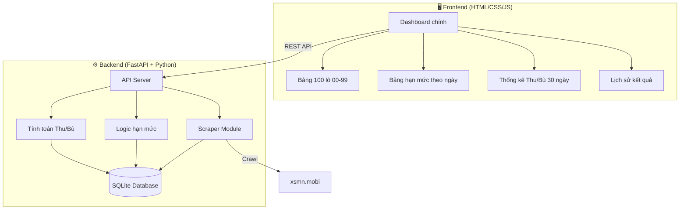
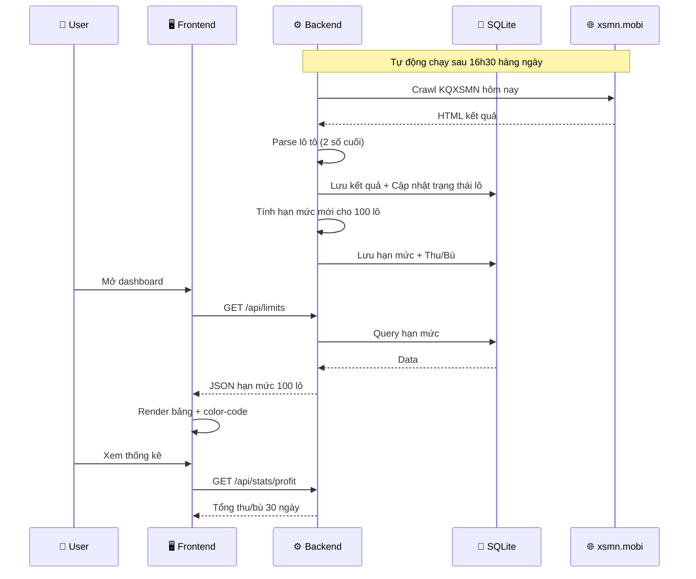

# Hệ Thống Quản Lý Hạn Mức Lô Đề XSMN

## Mô tả tổng quan

Xây dựng phần mềm **web-based** quản lý hạn mức đánh lô cho Xổ Số Miền Nam, tự động crawl dữ liệu từ [xsmn.mobi](https://xsmn.mobi/), áp dụng hệ thống hạn mức giảm dần, theo dõi lô về liên tiếp, và tính toán tổng thu/bù trong 30 ngày.

---

## User Review Required

> [!IMPORTANT]
> **Lựa chọn công nghệ**: Em đề xuất dùng **Python (FastAPI)** cho backend + **HTML/CSS/JS** thuần cho frontend. Anh muốn dùng stack khác không?

> [!IMPORTANT]
> **"Lô" ở đây là gì?**: Em hiểu "lô" = 2 số cuối của tất cả các giải trong bảng kết quả XSMN (lô tô). Mỗi ngày XSMN có 3 đài (riêng T7 có 4 đài), mỗi đài có 18 lô tô. Anh muốn tính riêng từng đài hay gộp tất cả đài trong ngày?

> [!WARNING]
> **Cách tính "ngày" cho hạn mức**: "Ngày 1" = ngày đầu tiên lô xuất hiện (gan), "Ngày 2" = ngày thứ 2 lô xuất hiện tiếp... hay "Ngày 1" = ngày đầu tiên phần mềm bắt đầu theo dõi lô đó? Em hiểu là: **Ngày 1 = lần cuối lô đó về**, rồi tính từ đó đi lên.

> [!IMPORTANT]
> **Tiền cược cố định bao nhiêu 1 điểm?** Ví dụ: 1 điểm = 23.000đ? Để em tính thu/bù chính xác.

---

## Kiến trúc hệ thống



---

## Proposed Changes

### Component 1: Backend - Data Layer

#### [NEW] `backend/database.py`
- SQLite database với các table:
  - `lottery_results`: Lưu kết quả xổ số (ngày, đài, các giải, lô tô)
  - `lo_tracking`: Theo dõi trạng thái từng lô (00-99): ngày cuối về, số ngày liên tiếp, hạn mức hiện tại
  - `bet_history`: Lịch sử đặt cược và kết quả (thu/bù)
- Tự động xóa dữ liệu > 30 ngày

---

#### [NEW] `backend/scraper.py`
- Crawl dữ liệu XSMN từ `https://xsmn.mobi/xsmn-30-ngay.html`
- Parse HTML bằng BeautifulSoup:
  - Tìm bảng `.v-kq-table` → trích các giải
  - Tìm bảng `.v-kq-table-loto` → lấy trực tiếp 2 số cuối (lô tô)
- Hỗ trợ crawl theo ngày cụ thể: `https://xsmn.mobi/xsmn-{d}-{m}-{yyyy}.html`
- Schedule tự động crawl sau 16h30 hàng ngày (sau giờ xổ)

---

### Component 2: Backend - Business Logic

#### [NEW] `backend/limit_engine.py`
- **Hạn mức giảm theo ngày** (lô chưa về):

| Ngày gan | Hạn mức max |
|----------|-------------|
| Ngày 1 (mới về) | 200đ |
| Ngày 2 | 180đ |
| Ngày 3 | 160đ |
| Ngày 4 | 140đ |
| Ngày 5 | 120đ |
| Ngày 6 | 100đ |
| Ngày 7 | 80đ |
| Ngày 8 | 60đ |
| Ngày 9 | 40đ |
| Ngày 10 | 20đ |
| Ngày 11+ | 10đ |

- **Hạn mức lô về liên tiếp** (override nếu thấp hơn):

| Số ngày liên tiếp | Hạn mức max |
|--------------------|-------------|
| 2 ngày liên tiếp | 150đ |
| 3 ngày liên tiếp | 100đ |
| 4 ngày liên tiếp | 50đ |
| > 4 ngày | Reset lên hạn mức ban đầu (theo ngày gan) |

- **Logic tính toán**:
  1. Mỗi ngày, sau khi có kết quả → cập nhật `consecutive_days` cho 100 lô
  2. Lô nào về → reset `days_since_last = 0`, tăng `consecutive_days`
  3. Lô nào không về → tăng `days_since_last`, reset `consecutive_days = 0`
  4. Hạn mức = `min(hạn_mức_theo_ngày, hạn_mức_theo_liên_tiếp)` (nếu có)

---

#### [NEW] `backend/profit_calculator.py`
- Tính tổng thu/bù trong 30 ngày:
  - **Thu**: Lô ăn → tiền thắng = số điểm × tỷ lệ trả thưởng (XSMN: 1 ăn 80 cho lô 2 số)
  - **Bù**: Lô thua → mất tiền cược = số điểm × giá 1 điểm
  - **Tổng**: Thu - Bù = Lãi / Lỗ
- Thống kê theo từng lô, theo ngày, theo đài

---

### Component 3: Backend - API Server

#### [NEW] `backend/main.py`
- FastAPI endpoints:
  - `GET /api/results/today` - Kết quả hôm nay
  - `GET /api/results/history?days=30` - Lịch sử 30 ngày
  - `GET /api/limits` - Bảng hạn mức 100 lô hiện tại
  - `GET /api/limits/{lo_number}` - Chi tiết hạn mức 1 lô
  - `GET /api/stats/profit` - Thống kê thu/bù 30 ngày
  - `POST /api/scrape` - Trigger crawl thủ công
  - `GET /api/consecutive` - Danh sách lô về liên tiếp

---

### Component 4: Frontend - Web Dashboard

#### [NEW] `frontend/index.html`
- **Layout chính**: Dashboard dark-mode, premium glassmorphism
- **4 panels chính**:

```
┌─────────────────────────────────────────────────────┐
│  📊 BẢNG HẠN MỨC 100 LÔ (00-99)                   │
│  ┌──┬──┬──┬──┬──┬──┬──┬──┬──┬──┐                   │
│  │00│01│02│03│04│05│06│07│08│09│  ← Color-coded     │
│  ├──┼──┼──┼──┼──┼──┼──┼──┼──┼──┤     theo hạn mức  │
│  │10│11│12│13│14│15│ ...       │                     │
│  └──┴──┴──┴──┴──┴──┴──────────┘                     │
├─────────────────────┬───────────────────────────────┤
│ 🔥 LÔ VỀ LIÊN TIẾP │  📈 THỐNG KÊ THU/BÙ 30 NGÀY  │
│ Lô 42: 3 ngày (100đ)│  Tổng thu: +12,500,000đ      │
│ Lô 78: 2 ngày (150đ)│  Tổng bù:  -8,300,000đ       │
│                     │  Lãi/Lỗ:   +4,200,000đ       │
├─────────────────────┴───────────────────────────────┤
│ 📋 LỊCH SỬ KẾT QUẢ XSMN (cuộn, filter theo đài)    │
└─────────────────────────────────────────────────────┘
```

#### [NEW] `frontend/style.css`
- Dark theme với gradient neon
- Color scale cho hạn mức: 🟢 200đ → 🟡 100đ → 🔴 20đ → ⚫ 10đ
- Glassmorphism cards
- Responsive design (desktop + mobile)
- Micro-animations khi cập nhật dữ liệu

#### [NEW] `frontend/app.js`
- Fetch API gọi backend
- Render bảng 100 lô với tooltip chi tiết
- Chart.js cho biểu đồ thu/bù
- Auto-refresh mỗi 5 phút (hoặc push notification)
- Filter theo đài, theo khoảng thời gian

---

### Component 5: Configuration & Deployment

#### [NEW] `backend/requirements.txt`
```
fastapi==0.115.0
uvicorn==0.30.0
beautifulsoup4==4.12.3
requests==2.32.3
aiosqlite==0.20.0
apscheduler==3.10.4
```

#### [NEW] `run.bat`
- Script khởi động nhanh trên Windows
- Install dependencies + start backend + open browser

---

## Luồng hoạt động chính



---

## Cấu trúc thư mục

```
e:\AI\project_earn_money\NCKH\Number\
├── backend/
│   ├── main.py              # FastAPI server + routes
│   ├── database.py           # SQLite models & connections
│   ├── scraper.py            # Crawl XSMN từ xsmn.mobi
│   ├── limit_engine.py       # Logic hạn mức giảm dần
│   ├── profit_calculator.py  # Tính thu/bù
│   └── requirements.txt
├── frontend/
│   ├── index.html            # Dashboard chính
│   ├── style.css             # Dark theme + glassmorphism
│   └── app.js                # Frontend logic + charts
├── data/
│   └── lottery.db            # SQLite database (auto-created)
└── run.bat                   # Quick start script
```

---

## Open Questions

> [!IMPORTANT]
> 1. **Tính theo đài nào?** XSMN mỗi ngày có 3-4 đài. Anh muốn:
>    - (A) Gộp lô tô TẤT CẢ đài trong ngày thành 1 set → lô nào xuất hiện ở bất kỳ đài nào đều tính là "về"
>    - (B) Tách riêng từng đài → theo dõi riêng biệt

> [!IMPORTANT]  
> 2. **"Phần mềm off"** nghĩa là phần mềm chạy offline trên máy anh (localhost), đúng không? Không cần deploy lên server?

> [!IMPORTANT]
> 3. **Giá 1 điểm** và **tỷ lệ ăn** là bao nhiêu? Ví dụ phổ biến:
>    - 1 điểm = 23,000đ
>    - Lô 2 số: ăn 1 trả 80 (tức đánh 1đ ăn 80 × 23,000 = 1,840,000đ)

> [!WARNING]
> 4. **Hạn mức giảm theo ngày** - Em cần confirm: ý anh là **ngày lô KHÔNG VỀ** (ngày gan) thì giảm hạn mức? Tức là:
>    - Lô vừa về hôm nay → max 200đ (cho ngày mai đánh)
>    - Lô 2 ngày chưa về → max 180đ
>    - ...
>    Hay ngược lại: lô **VỀ** ngày 1 → 200đ, về ngày 2 → 180đ?

---

## Verification Plan

### Automated Tests
- Chạy `python -m pytest backend/tests/` để test logic hạn mức
- Test scraper với mock HTML data
- Test profit calculation với sample data

### Manual Verification
- Truy cập `http://localhost:8000` → kiểm tra dashboard
- So sánh dữ liệu crawl với kết quả trên xsmn.mobi
- Verify color-coding hạn mức trực quan
- Test trên cả desktop và mobile
